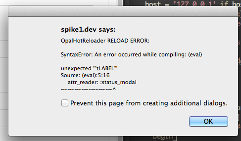

# OpalHotReloader

opal-hot-reloader is a hot reloader for [Opal](http://opalrb.org).  It has built in [react.rb](http://reactrb.org) support and can be extended to support an arbitrary hook to be run after code is evaluted.  It watches directories specified and when a file is modified it pushes the change via websocket to the client.  opal-hot-reloader reloader will reload the following without reloading the whole page and destroying any state the page has.
- opal code
- css (currently supporting Rack::Sass:Place and Rails asset pipeline)

## Installation

Add this line to your application's Gemfile:

```ruby
gem 'opal_hot_reloader'
```

And then execute:

    $ bundle

Or install it yourself as:

    $ gem install opal_hot_reloader


## Usage

### Server Setup

#### NOTE: fixed for Opal 0.10 as of commit d2dc849 - repull if not working for 0.10.0

After adding `gem "opal_hot_loader"` to your gemfile, you must start the server-side part. This will allow websocket connections, and whenever a file is changed it will send it via the socket to listening clients.

To start the server-side of the hotloader:
```
opal-hot-reloader -p 25222 -d dir1,dir2,dir3

Usage: opal-hot-reloader [options]
    -p, --port [INTEGER]             port to run on, defaults to 25222
    -d, --directories x,y,z          comma separated directories to watch
```

For a react.rb Rails app, opal-hot-reloader automatically includes app/assets/javascripts,app/views/components if they exist

Example adding 2 directories
```
opal-hot-reloader -d app/js,app/client/components
```

You may consider using [foreman](https://github.com/ddollar/foreman/)
and starting the Rails server and hot reloader at the same time.  If
you are doing react.rb development w/Rails, you may already be doing
so with the Rails server and webpack.


### Client Setup

Require in an opal file (for opal-rails apps application.js.rb is a good place) and start listening for changes:

#### Note: OpalHotReloader.listen() deprecation
OpalHotReloader.listen() used to take a 2nd Boolean parameter to signify a reactrb app.  This is deprecated and no longer needed.

```ruby
require 'opal_hot_reloader'

# @param port [Integer] opal hot reloader port to connect to. Defaults to 25222 to match opal-hot-loader default
OpalHotReloader.listen(25222)
```

If you are using the default port then you can just call:
```
OpalHotReloader.listen
```

#### Alerts



By default, if there is an error hot loading code, opal_hot_reloader
will present an alert of the error. The following options can be used
to turn the alerts on and off:

```ruby
OpalHotReloader.alerts_on!  # turns on alerts
OpalHotReloader.alerts_off! # turns off alerts

```


This will open up a websocket from the client to the server on the given port. The server-side should already be running.

Enjoy!

#### Run only in development on Rails
One way to run this only in development on Rails is to change your application.js.rb to application.js.rb.erb and add this to the bottom of the file

```ruby
<% if Rails.env.development? %>
    require 'opal_hot_reloader'
    OpalHotReloader.listen
<% end %>
```

## Vision

Some of you might be asking?  Why do this, isn't this reinventing the
wheel by programs like webpack, etc.? I should mention that
reinventing the wheel seems happens all the time in the Javascript
world.

Yes and no. opal-hot-reloader is an "All Ruby(Opal)", self contained
system, so if you're doing any kind of Opal frontend/Ruby backend
webserver type of project, you will be able to just drop in
opal-hot-reloader and it will work out of the box without having
install/configure webpack or similar.

I believe it will be most advantageous for Opal to be able to straddle
a hybrid approach where:

* With Opal and Rails, we use the existing mechanism, sprockets, to
serve up all the things it does in the "normal" Rails ecosystem. I.e
we want to work with the system. We want all the perks of Ruby and
Rails without have to hand cobble it ourselves
* We use webpack or similar for being a "1st class JS citizen".  This
gives us access to all the frontend assets in npm, we want all those
options and perks.

While I do favor moving as much Javascript to webpack, following suit
to React.js's lead, I see an "all webpack solution" for Opal apps
being only one of a few permutations, and not particularly appealing
to most Rails programmers - who I think is the largest demographic
likely to want to do Opal programming.

While we wait for the other approaches to evolve and get implemented
this solution is here and works now.  It works with an "All Ruby"
system, it works with a Rails app that is using webpack to provide
react.js components to react.rb.

### Goals
* Bring the benefits of "leading edge web development" to All Ruby
  (via Opal) full stack development.  One of my efforts to be more
  like Einstein in “Opening up yet another fragment of the frontier of
  beauty” - i.e. share the joy.
* Batteries included out of the box - make it (increasingingly) easy
  for Rubyists to enjoy the previous goal.  This is a manifestation of
  the "Ruby Way" of making the programmer happy
* Try to add the least amount of additional dependencies to projects
  it's used in


## Screencasts

* Quickie intro to opal-hot-reloader https://youtu.be/NQbzL7fNOks

## Development

After checking out the repo, run `bin/setup` to install dependencies. Then, run `rake spec` to run the tests. You can also run `bin/console` for an interactive prompt that will allow you to experiment.

To install this gem onto your local machine, run `bundle exec rake install`. To release a new version, update the version number in `version.rb`, and then run `bundle exec rake release`, which will create a git tag for the version, push git commits and tags, and push the `.gem` file to [rubygems.org](https://rubygems.org).

## Contributing

Bug reports and pull requests are welcome on GitHub at https://github.com/fkchang/opal_hot_reloader.


## License

The gem is available as open source under the terms of the [MIT License](http://opensource.org/licenses/MIT).

